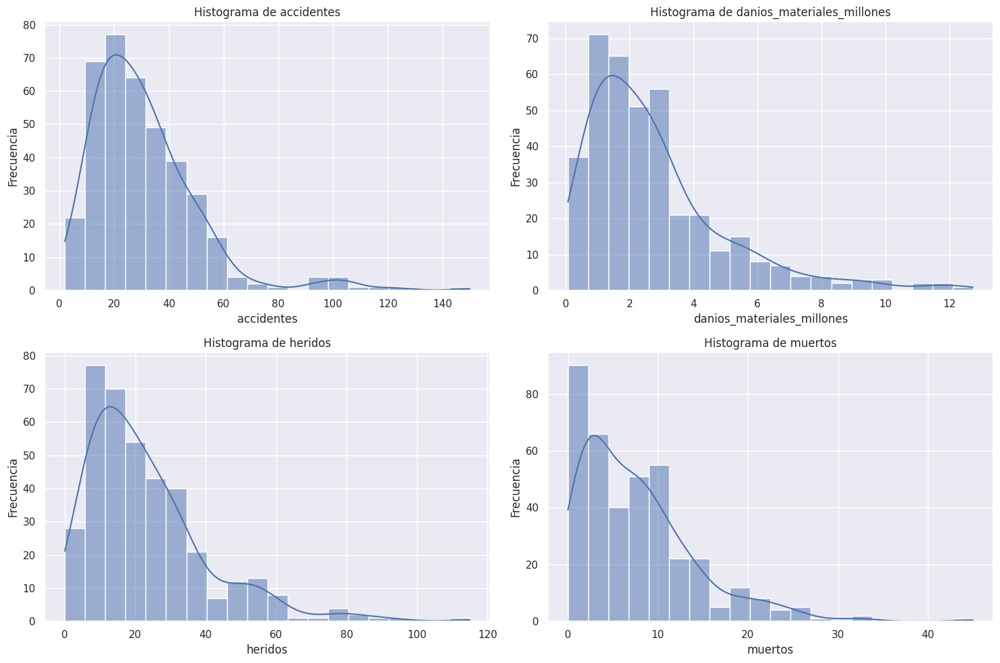
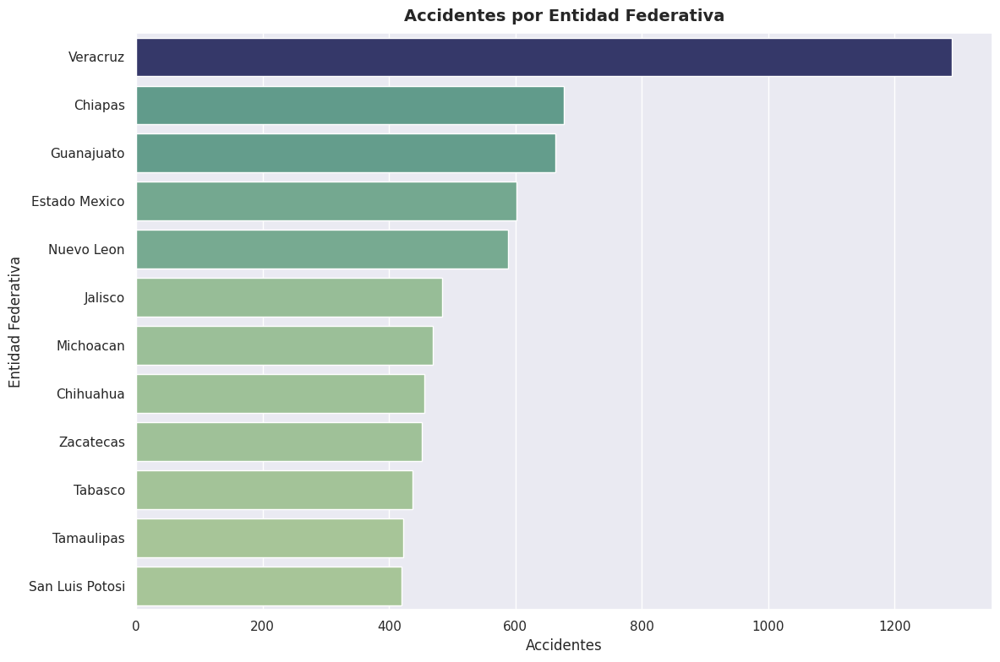
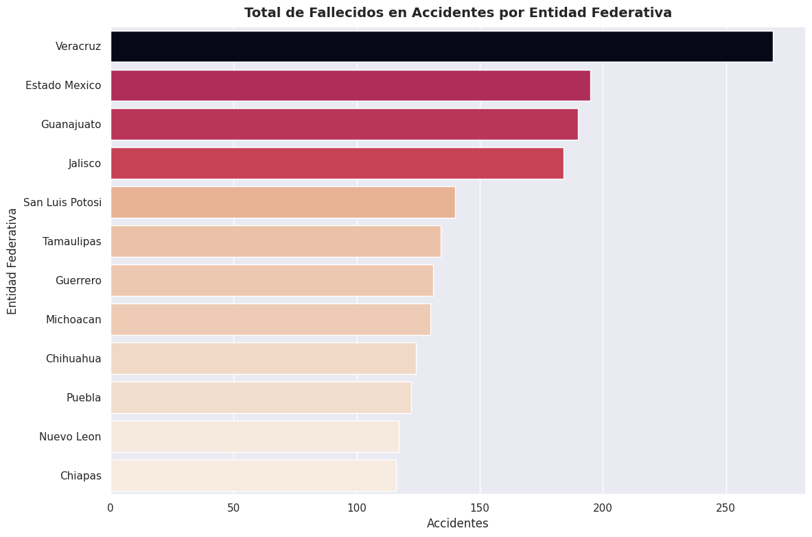
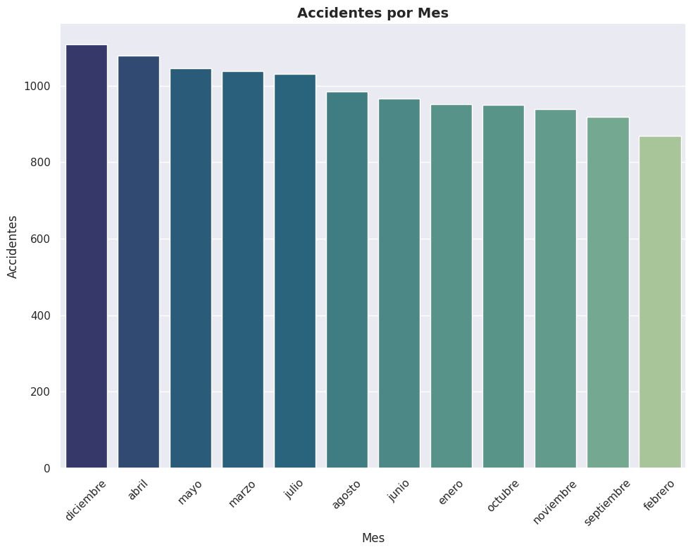
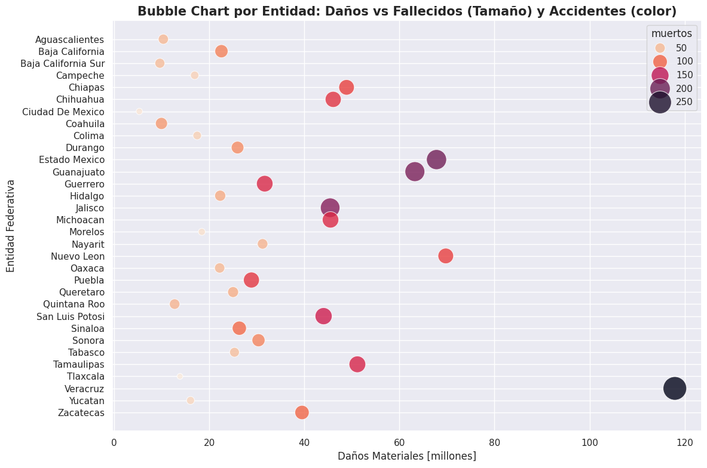
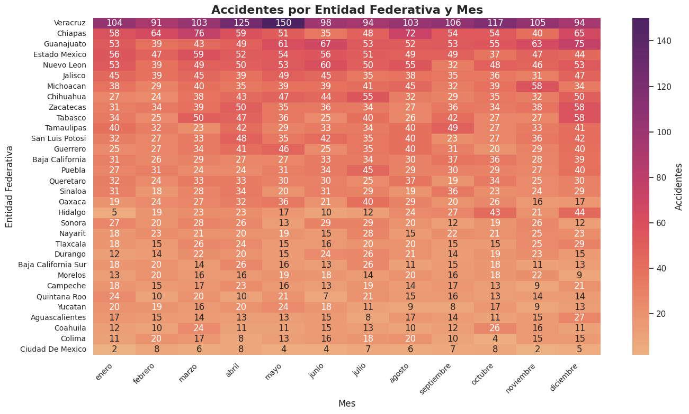
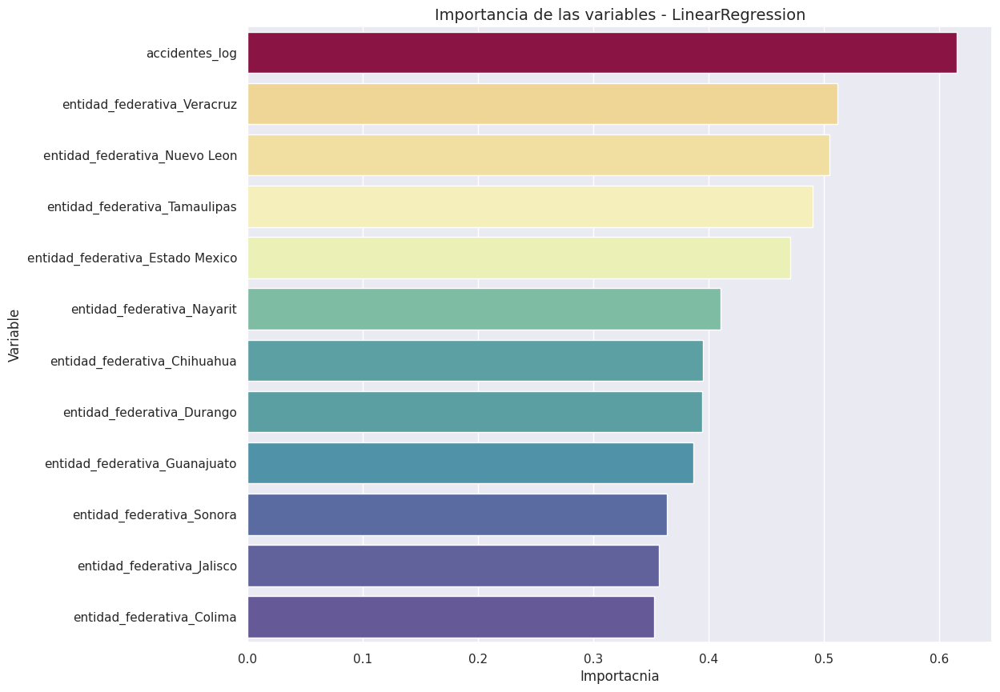

# Predicción de Daños Materiales en Accidentes Viales (México) 

Este projecto tiene como **objetivo** analizar y predecir los daños materiales provocados por accidentes viales en México, utilizando técnicas de **Análisis Exploratorio de Datos (EDA)** y **modelado predictivo con Machine Learning**. 

Los datos provienen de la base de datos [Acidentes de Tránsito por Mes](https://datos.gob.mx/dataset/accidentes_transito/resource/8a46ba6d-9d40-4029-8d7e-216feeff950e)  de la Secretaría de Infraestructura, Comunicaciones y Transportes (SICT). La estructura contiene información por mes y entidad federativa. 

## Estructura del Repositorio 
|**Archivo**|**Descripción**|
|---|---|
|```visualizations```|Carpeta con las visualizaciones exportadas (png)|
|```ML_Accidentes.ipynb```|Notebook donde se elaboró el modelo de Machine Learning|
|```MX_TRAFFIC_ACCIDENTS.ipynb```| Notebook de EDA|
|```README.MD```|Documentación del proyecto|
|```data-2025-11-24.csv```|Datos originales|
## Estructura del Dataframe 
El dataframe contiene la siguiente estructura
|**Variable**|**Descripción**|
|---|---|
|```entidad_federativa```|Entidad Federativa|
|```mes```|Mes del año|
|```accidentes```|Número de accidentes|
|```danios_materiales_millones```|Daños Materiales en millones de pesos debidos al accidente|
|```heridos```|Número de heridos en el accidente|
|```muertos``` |Número de fallecidos en el accidente|

## Análisis Exploratorio de Datos (EDA) 
Se realizó un EDA para comprender la estructura del dataset y detectar patrones releveantes antes del modelado. 
### Revisión inicial del dataset
- No se encontraron valores nulos
- Se revisaroon tipos de datos y rangos
- Se generó una variable adicional como el mes numérico

### Distribución de variables numéricas
- Accidentes, heridos, muertos y daños presentaron distribuciones sesgadas a la derecha.
- Se utilizará el uso de transformaciones logarítmicas para mitigar el sesgo.

### Análisis Temporal
- Se evaluaron tendencias mensuales y variaciones en accidentes y daños.

### Correlaciones 
- Accidentes y daños materiales mostraron la relación más fuerte.

## Visualizaciones del EDA
Se generaron diversas visualizacionesp para identificar patrones, distribuciones y diferencias entre entidades y meses. Entre las principales realizadas destacan:

### Distribución de variables numéricas 
- Histograma de **accidentes, heridos, muertos y daños materiales**.
- Las gráficas muestran un sesgo positivo, lo que justificó el uso de transformaciones logarítmicas.



### Comparación por entidad federativa
- Gráfico de barras con los estados con mayor número de accidentes, heridos, fallecidos y daños.



### Comportamiento mensual
- Gráfico de baras para analizar tendencias a lo largo del año.
- Identificación de meses con mayor incidencia


### Correlación entre variables
- Heatmap de correlaciones para detectar relaciones relevantes.

### Bubble Chart por Entidad: Daños vs Fallecidos  (Tamaño) y Accidentes 
- Se elaboró un Bubble Chart por entidad federativa, donde cada punto representa el daño material, el tamaño de este indica el número de fallecidos por entidad.
 

### Accidentes por Entidad Federativa y Mes
- Se hizo un heatmap donde ordenado donde se observa que el mayor número de accidentes a lo largo de los meses del año es el estado de Veracruz.
 
## Preparación de Datos 
Transformaciones aplicadas:
- Aplicación de logaritmo para estabilizar distribuciones:
  - ```accidentes_log```
  - ```heridos_log```
  - ```muertos_log```
  - ```danios_log``` (variable objetivo)
- Creación de variables dummy para:
  - Entidad Federativa
  - Mes
- División de datos:
  - ```train_test_split``` con 20% para prueba.

## Modelado
Se utilizó **Regresión Lineal** como modelo base para predecir los daños materiales. 

**Pipeline del modelado**: 
- Ajuste del modelo
- Predicción sobre el set de test
- Evaluación con métricas de error
- Interpretación de coeficientes

## Selección de Variables (Backward Elimination) 
Para mejorar la interpretación del modelo, se aplicó **Backward Elimination** usando ```statsmodels```: 
- Se eliminaron variables con **p-value>0.05**
- El modelo final redujo el número de variables.
- Se compararon métricas antes y después.

### Resultados comparativos:
|**Métrica**|**Antes de BE**|**Después de BE**|
|---|---|---|
|R²|0.8274|0.8161|
|RMSE|0.2337|0.2412|

El modelo posterior a Backward Elimination es más simple pero con un ligero aumento del error. 

### Importancia de variables

 

Aunque la regresión lineal no da *importancia* como los árboles de decisión, se interpretaron los coeficientes de las variables:
- La variable que más afecta a los daños fue ```accidentes_log```
- Algunas entidades, como Veracruz, Nuevo León y Tamaulipas, tienen una fuerte influencia.

## Evaluación del Modelo
Se utilizaron las métricas:
- R²
- MSE
- RMSE
También se generaron:
- Gráfica de valores reales vs predichos
- Gráfica de residuales
- Q-Q  Plot de los Residuales

## Visualizaciones
En la carpeta **visualizations** se incluyen:
- Boxplots
- Heatmap de correlación
- Gráfica de residuales
- Gráfica de valores reales vs predichos

## Conclusiones
- El número de accidentes es el predictor más fuerte de los daños materiales.
- Algunas entidades federativas muestran patrones particulares que influyen en los daños.
- La técnica de Backward Elimination simplificó el modelo con una ligera pérdida de desempeño.

## Próximos Pasos
- Probar modelos más robustos (Random Forest, XGBoost)
- Evaluar efectos temporales más finos.
- Implementar un dashboard interactivo.

## Créditos
- **Autor**: [Andrés Guzmán Rodríguez](https://github.com/AndrsGzRo)
- **Fuente**: [Acidentes de Tránsito por Mes](https://datos.gob.mx/dataset/accidentes_transito/resource/8a46ba6d-9d40-4029-8d7e-216feeff950e)  de la Secretaría de Infraestructura, Comunicaciones y Transportes (SICT).
